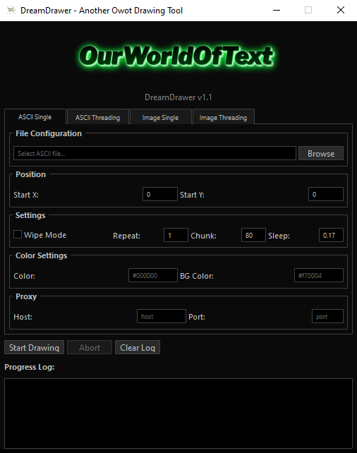
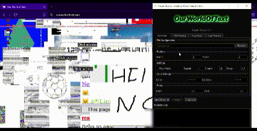
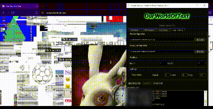

<p align="center">
  
</p>

## 📖 Overview
**DreamDrawer** is a lightweight Python + Qt GUI utility that lets you draw ASCII art or paste images directly onto the canvas of [OurWorldOfText](https://ourworldoftext.com).
It communicates via raw sockets, supports multi-threading & proxies, and divides the canvas for pixel-perfect placement.
<p align="center">
  
</p>

## ⚠️ Responsible Use Disclaimer

> [!IMPORTANT]
> **🛑 Use DreamDrawer responsibly.
> Never use it to mount denial-of-service attacks, spam large sections, or draw content that harms, harasses, or endangers any living being in any form. Misuse violates the spirit of creative collaboration so keep it on the low :)
> Pasting large drawings or wiping gigantic parts will result in your proxies/ip getting banned or mass server side lags.**

## ✨ Key Features

| Feature             | Description                                                                |
| ----------------- | ------------------------------------------------------------------ |
| Images 🖼️ | Choose any PNG/JPG; auto-convert to block colors |
| ASCII 📝 | Use ASCII characters to express your arts |
| Quadrants / Blocks 🧩 | Use custom geometric Shapes characters for clear drawings |
| Threading ⚡ | Parallel workers with faster fills and minimal lag |
| Proxy 🌐 | Route traffic through SOCKS4/5 or HTTP proxies |
| Wiping 🧹 | Clean your existing arts to make place for anothers |

## 🚀 Quick Start
### First Method
Directly execute the release version :P

### Second Method

1. Clone the repo
```bash
$  git clone https://github.com/yourname/SkyDrawer.git
$  cd SkyDrawer
```
2. Create and activate venv (recommended)
```bash
$  python -m venv venv
$  source venv/bin/activate
```
3. Install dependencies
```bash
$  pip install -r requirements.txt
```
4-1. Launch it directly
```bash
$  python3 gui.py
```
4-2. or Compile it for windows
```bash
$  pyinstaller --onefile --windowed --name "DreamDrawer" --clean --add-data "header.png;." --add-data "favicon.ico;." --icon=favicon.ico --hidden-import=PyQt5.QtCore --hidden-import=PyQt5.QtGui --hidden-import=PyQt5.QtWidgets --hidden-import=PIL --hidden-import=websocket gui.py
```

## 🛠️ Usage Tips
| Feature             | Description                                                                |
| ----------------- | ------------------------------------------------------------------ |
| Position | Choose the starting point of the paste as shown in the picture (X,Y) |
| Wipe Mode | Can be uses to delete pastes by printing empty characters in the form of the image/ASCII |
| Repeat | Choose how many repeatitions input (inf) if you want infinite |
| Chunks & sleep | Preconfigured values that goes with the server capacity for the print any changes may resut in empty parts of the drawing or may cause lags or DOS/DDOS |
| Color / BG color | Hex value of the ASCII and ASCII threading mods |
### Image Threading Mode
<p align="center">
  
</p>

### Wiping Option
<p align="center">
  
</p>

## 🔮 Upcoming Features
`(Check the dev branch or open an issue to contribute!)`

| Mode             | Teaser                                                                |
| ----------------- | ------------------------------------------------------------------ |
| ***Mayham Mode 💥*** | Causes nuclear drops everywhere (will try keeping it private or else) |
| ***Clone Section 🧬*** | Copy zone x,y to another x,y and use the copy for a fresh paste |
| ***Full Legacy Chars ᝰ.ᐟ*** | Self-explanatory |
| ***Chat Utilities 💬*** | Full toolkit for messing up with OWOT chats |
| ***Links Paster 🔗*** | Advertise everywhere anywhere from an x,y to another x,y |

## 🤝 Contributing
Feel free to fork, modify, change anything related to this project and kindly mention this original source.

## ⭐ Adding a Star would mean a lot :^
